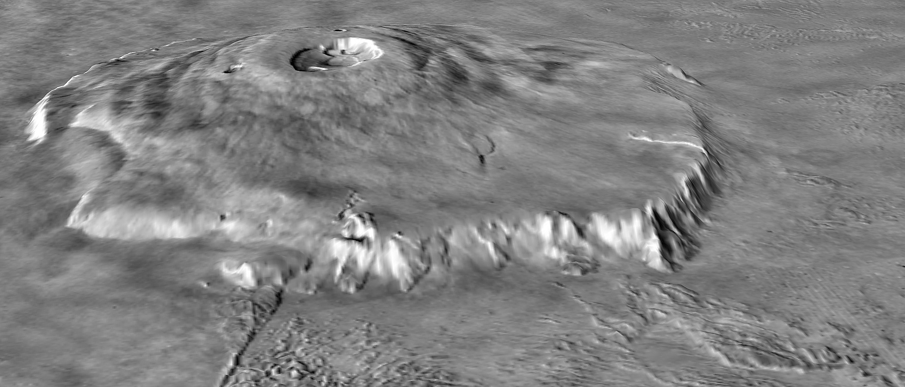

# Airship flying on Mars

**Mars** appears in the sky as a red, star-like point.
The ancients named this planet after the god of war because the color resembled blood.

**Mars** has always intrigued scientists and the public because, of all the planets in our solar system, its environment most closely resembles Earth's. Its climate is very harsh and its atmosphere is a thin layer compared to conditions on Earth.
 
**Mars** is known in the solar system for its highest mountain ranges and largest canyons. The highest mountain on Mars, and at the same time the largest in the Solar System, is **Olympus Mons**

 

[Fig.1,https://upload.wikimedia.org/wikipedia/commons/7/73/Olympus_Mons_topography.jpeg] 
 

is more than 25 kilometers high and has a base diameter of about 700 kilometers. The second monumental "phenomenon" on Mars is the **Valles Marineris** canyon system, which is 4,000 kilometers long and 2 to 7 kilometers deep. There you can also find a 6 km deep impact crater - a reminder of the encounter with the meteor Hellas Planitia which, is 2,000 km in diameter.

No tectonic activity has been observed on Mars, but traces of erosion are common there. It is believed that about 4 million years ago all these depressions, valleys, etc. were filled with water. Rivers as wide as several tens of kilometers flowed there, and perhaps even oceans existed.

One of the most distinctive features of the Martian surface are the so-called ice caps, found at the poles. They are composed mainly of solidified carbon dioxide (so-called "dry ice"). During the period when the northern hemisphere is in summer, dry ice completely resublimates to carbon dioxide, leaving a layer of ice. It is not known whether there is also frozen water beneath the surface of the southern cap, as this cap never completely disappears. Frozen water may also be under the surface of Mars.

The radius of Mars is about twice that of Earth. The Martian day (the period between successive sunrises) is approx. 38 minutes longer than an Earth day.

# Purpose of the program

1. to determine the type of ship moving in the atmosphere of Mars 
2. making its mass analysis.
	
	At first, the type of flying vehicle was selected taking into account its parameters, i.e. reliability, ease of operation, ease of control, ease of assembly, transportability. 
It was assumed that the object of research would be an airship. Its mass analysis was carried out based on the total masses of previous missions to Mars and a preliminary estimate of the mass of the flying vehicle derived from the applied Archimedes' law for the known volume of the assumed carrier gas. 
The next step in the work was the simultaneous determination of the masses of the various components of the airship:
    - shell
    - nacelle
    - horizontal rudders
    - vertical rudders
    - engine and propeller
    - battery 
    - solar cells
    - scientific equipment
Each of the above elements was included in the total mass except for the scientific equipment. Its mass was determined as the difference of the total mass and the sum of the masses of the individual elements.
	For the given mass of the flying ship, its dimensions and shape, a pre-selected 
motor, battery and propeller.

## Created by Adrian Szklarski, 03.2023

